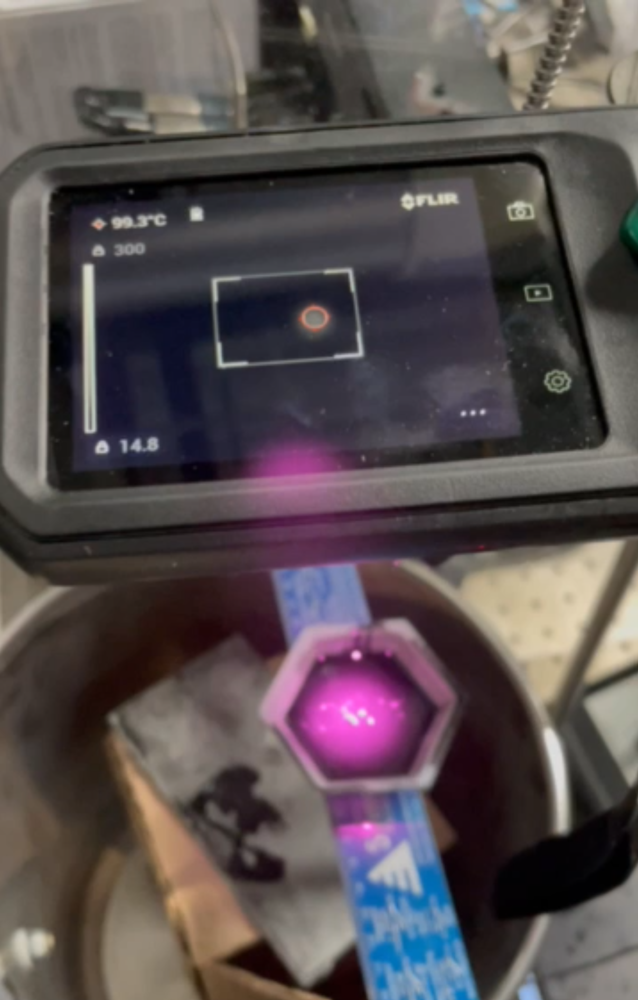
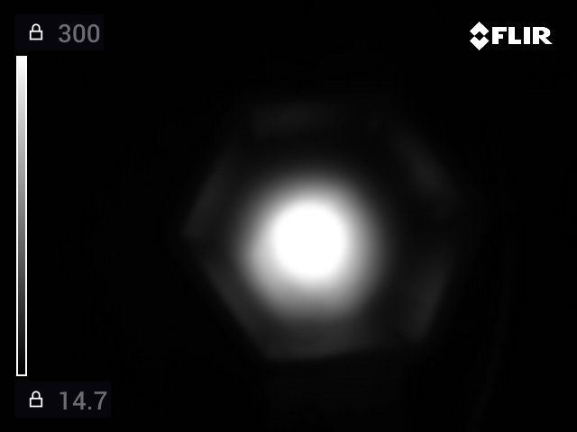
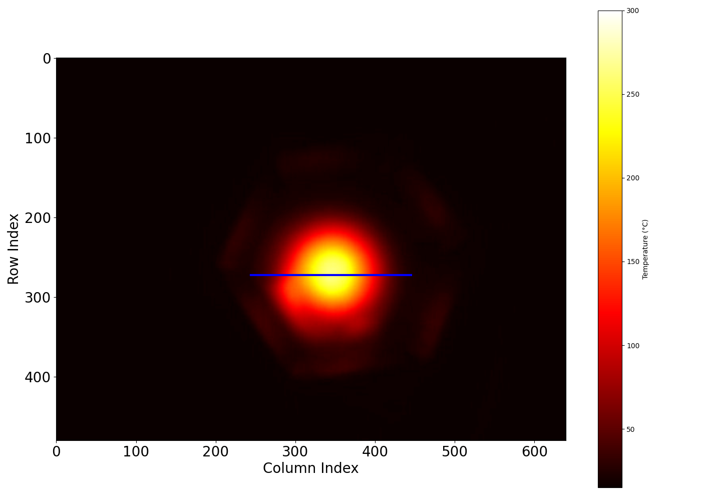
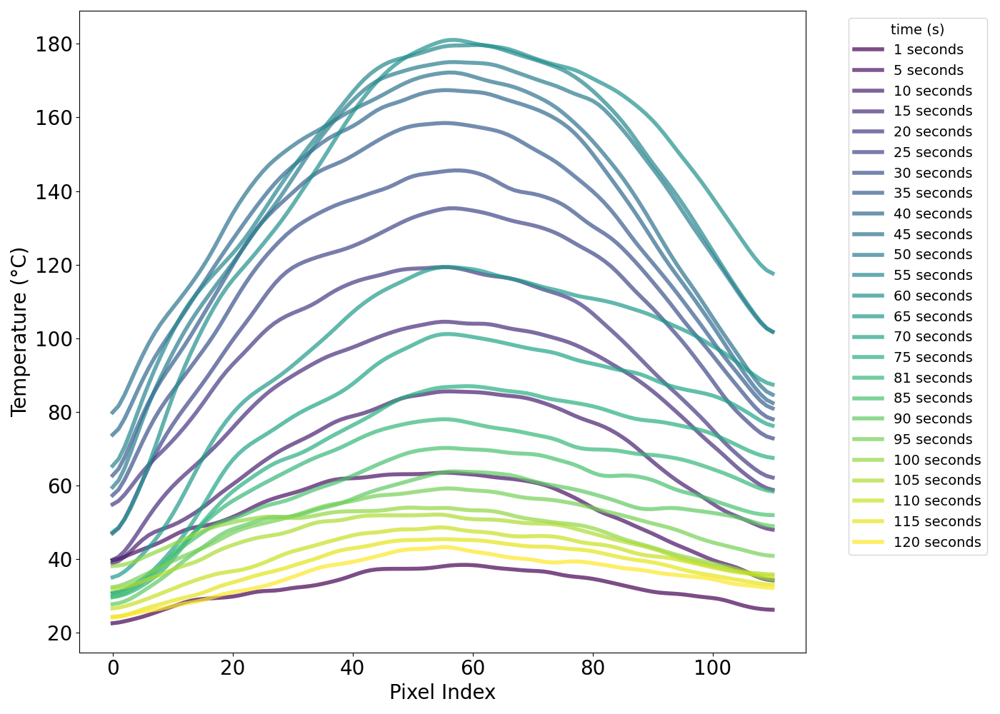

# Thermal Image Plotting and Fitting

This script takes the path to a folder of FLIR CX-3 thermal images and plots the temperature profile along a line through the image. It also determines the maximum temperature of the object (even if the detector is saturated) at each image's time (from the files' metadata) and plots the relationship.

## How to use

**Experimental details for best results on a FLIR CX-3:**

- disable the edge detection overlay ("MSX")
  
- set the FLIR camera to black and white mode ("white hot")
  
- change the temperature range from "-20 C to 150 C" to "0 C to 300 C" (or similar)
  
- modify the temperature scale from its default auto-scale to a fixed scale (here, "15 C" to "300 C")
  
- mind the microbolometer minimal focal distance (10 cm)

- keep consistent framing across a series of thermal images
  
- keep the region of interest contained within the bounds of the display with little-to-no overlap with the FLIR camera's temperature scale or the watermark

**Script overview:**

1. extract temperature arrays and times from the thermal images
   - map the pixel values for each image to the temperature range
   - export a csv of temperature arrays for each time
     - time is extracted from exif data within the image relative to a manually entered start time
2. find the region of interest and extract a thermal profile
    - zero the rows and columns where the FLIR camera's temperature scale and watermark appear
    - find a representative position for the thermal profile line (current method generates lines centered at the highest value pixels and accepts that which sums to the highest value)
      - this can be visualized by uncommenting the `TroubleshootLinePosition` function
3. plot the temperature profile along this line and the maximum temperature vs time
    - plot the temperature profile along this line for each image on a single figure
    - generate a fit for each profile
      - partially to smooth the mild jpeg compression artifacts, but largely to reasonably estimate of maximum temperature for profiles that exceed the IR detector's range
      - baseline + gaussian seems to work well if the profile is not saturated or if the saturated region (i.e. where T = maximum possible T) is removed from the fit
    - extract the maximum temperature for each profile from these fits and plot them vs time
    - fit the max temperature vs time (exponential seems ok, need to think about this more)

### Figure 1: Experimental setup
808 nm CW ~7 W/cm^2 beam on uncured ~2 cm thick pouring of 1% wt/wt CB-PDMS into a weigh boat

### Figure 2: Example Thermal Image Input

### Figure 3: CSV of mapped temperatures across multiple images

### Figure 4: Heat map for a given column with the profile line overlaid

### Figure 5: Heating and cooling profiles across images (smoothed, no fit)

### Figure 6: Heating thermal profiles across images (no smoothing, gaussian fit)

### Figure 7: Max temperature vs time with exp. fit

## todo

- [x] fix line centering
  - [x] output the image with the line overlaid to see if it's stable and within the image bounds (uncomment the `TroubleshootLinePosition` function)
  - [x] make the position consistent (instead of using max: (1) find which pixel has the highest gaussian kernel weight or (2) pick the high point of image ~3 and use that pixel location going forward) --> ended up (1) zeroing outside of the region-of-interest bounds and then finding the line which summed to the highest value
  - [x] increase line length by enough to capture T_infinity
- [x] remove smoothing and instead try a baseline + gaussian fit
  - [x] replace the over-exposed max T scatterplot values with the amplitude of the fit trace
- [x] update the fitting model for max T vs time
  - [ ] exponential seems to fit nicely, but I think to think about the physical implications more and understand both the fit equation and the error propagation
- [x] remove the "cooling" profile from the main figure
  - [ ] make their own figure starting from the final "heating" profile
- [ ] polish formatting (font/size, titles, grids, labels, positions, point size, fit equations)

## misc. notes

- screen updates at about 9 Hz

- measurement accuracy is +/- 3% across entire temperature range (0 C - 300 C)
  
- how are thermal images 640 x 480  when the "IR resolution" is only 198 x 96?

- unclear to precisely what extent emissivity differences and reflected radiation are accounted for in the temperature mapping...interestingly, the weigh-boat wings 
  
## resources

- FLIR CX-3 datasheet [(click here)](https://support.flir.com/DsDownload/App/Compare/?Lang=En&PN_LIST=90501-0101,90501-0201)