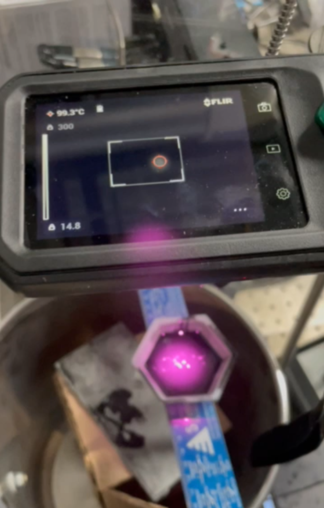
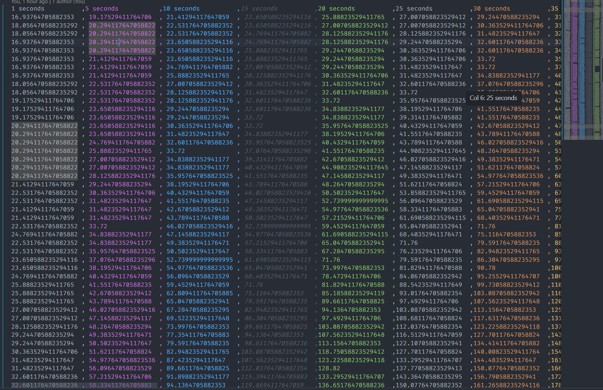
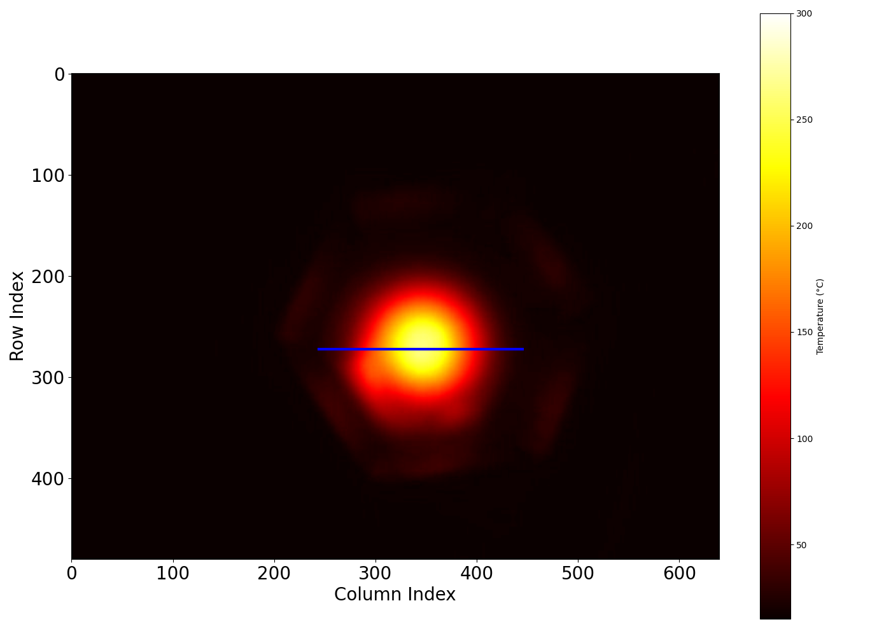
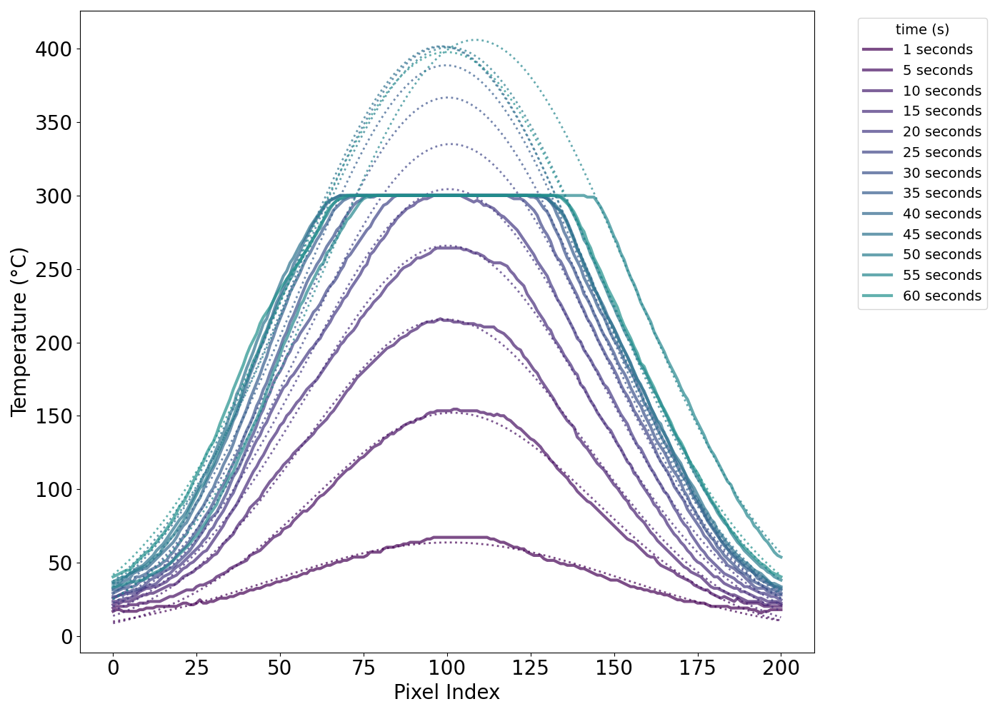
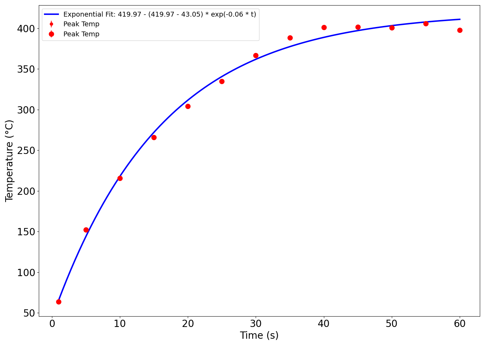
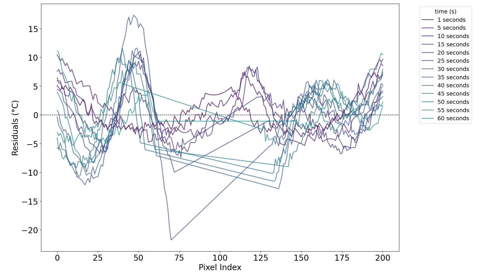
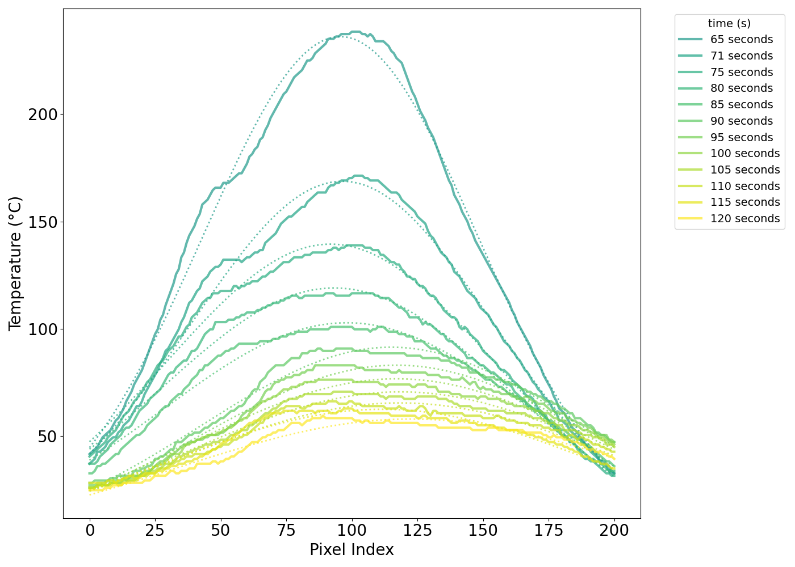
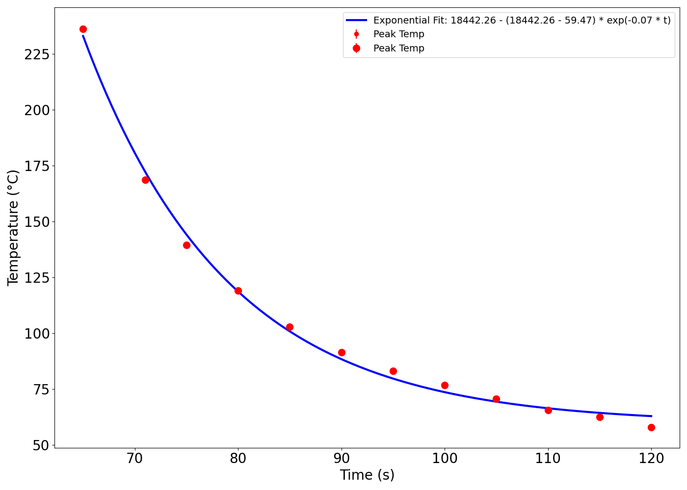

# Thermal Image Plotting and Fitting

This script takes the path to a folder of FLIR CX-3 thermal images and plots the temperature profile along a line through the image. It also determines the maximum temperature of the object (even if the detector is saturated) at each image's time (from the files' metadata) and plots the relationship.

## Best principles for the FLIR CX-3

- disable the edge detection overlay ("MSX")
  
- set the FLIR camera to black and white mode ("white hot")
  
- change the temperature range from "-20 C to 150 C" to "0 C to 300 C" (or similar)

  - note that a red "hot spot" view can be enabled to show the hottest pixel in the image (which can be useful for real time monitoring), but it will not influence the upper bound of the temperature scale which often results in a destructively saturatated image  
  
- modify the temperature scale from its default auto-scale to a fixed scale (here, "15 C" to "300 C")
  
- mind the microbolometer minimal focal distance (10 cm)

- keep consistent framing across a series of thermal images
  
- keep the region of interest contained within the bounds of the display with little-to-no overlap with the FLIR camera's temperature scale or the watermark

## Script overview

### 1. extract temperature arrays and times from the thermal images

 - map the pixel values for each image to the temperature range
 - export a csv of temperature arrays for each time
   - time is extracted from exif data within the image relative to a manually entered start time

### 2. find the region of interest and extract temperatures along a line through the hottest point

 - zero the rows and columns where the FLIR camera's temperature scale and watermark appear
 - find a representative position for the thermal profile line (current method generates lines centered at the highest value pixels and accepts that which sums to the highest value)
   - this can be visualized by uncommenting the `TroubleshootLinePosition` function

### 3. plot and fit (1) the temperature along this line as well as (2) the maximum temperature vs time

 - plot the temperature profile along this line for each image on a single figure
 - generate a fit for each profile
 - partially to smooth the mild jpeg compression artifacts, but largely to reasonably estimate of maximum temperature for profiles that exceed the IR detector's range
   - baseline + gaussian seems to work well if the profile is not saturated or if the saturated region (i.e. where T = maximum possible T) is removed from the fit\
 - extract the maximum temperature for each profile from these fits and plot them vs time
 - fit the max temperature vs time (exponential seems ok, need to think about this more)

## Example

### Figure 1: Experimental setup

Here, a 808 nm CW ~7 W/cm^2 beam (unfocused from the fiber optic tip) was incident on a 20 g sample (~2 cm deep) of uncured, degassed 1% wt/wt CB-PDMS in a weigh boat.  The thermal camera was positioned ~10 cm from the weigh boat and the laser was turned off at t = 60 s.

### Figure 2: Example thermal image

### Figure 3: CSV of mapped temperatures across multiple images

Note that the script can be run in a modular fashion such that the CSV is created once and then the plotting and fitting parameters can be fine-tuned without re-running the image processing.

### Figure 4: Heat map for an arbitrary column with the profile line overlaid

Note that the scale bar and watermark would appear in the worked up image if not for the script zeroing these regions.

### Figure 5: Heating and cooling profiles across images (smoothed, no fit)

Note that while images were taken at second 1 as well as every 5 seconds for 2 minutes, the laser was turned off after the first 60 seconds, and so the final 60 seconds are cooling profiles.

### Figure 6: Heating thermal profiles across images (no smoothing, gaussian fit)

Note that the gaussian fits estimate the maximum temperature of the object for saturated profiles.

### Figure 7: Max temperature vs time with exp. fit

### Figure 8: Residuals for the heating fits

### Figure 9: Cooling thermal profiles across images (no smoothing, gaussian fit)

Figures 8 and 9 are similar to Figures 6 and 7, but for the cooling profiles.  Their usefulness is unclear at this time, but the seeing the viridis colormap transition across two images is cool and I am tired.

### Figure 10: Max temperature vs time with exp. fit for cooling traces

## todo

- [x] fix line centering
  - [x] output the image with the line overlaid to see if it's stable and within the image bounds (uncomment the `TroubleshootLinePosition` function)
  - [x] make the position consistent (instead of using max: (1) find which pixel has the highest gaussian kernel weight or (2) pick the high point of image ~3 and use that pixel location going forward) --> ended up (1) zeroing outside of the region-of-interest bounds and then finding the line which summed to the highest value
  - [x] increase line length by enough to capture T_infinity
- [x] remove smoothing and instead try a baseline + gaussian fit
  - [x] replace the over-exposed max T scatterplot values with the amplitude of the fit trace
- [x] update the fitting model for max T vs time
  - [ ] exponential seems to fit nicely, but I think to think about the physical implications more and understand both the fit equation and the error propagation
- [x] remove the "cooling" profile from the main figure
  - [x] make cooling profiles figures similar to the heating profiles
- [x] simplify the time extraction so the user doesn't have to manually enter the start time --> found the time for the first image and created a "time-offset" variable to subtract from the first image time for when the first image was taken after t = 0
- [ ] generalize the magic number cutoff index for the time where I turned off the laser
- [ ]  consider the fitting cutoff (it has been updated to ignore points within 30 C of the threshold to avoid any detector saturation influence, but I want to say the 300 C cutoff is mostly digital, i.e., the detector response should be robust up to 300 C)
  - [ ] assess the effect of the cutoff on the fit
  - [ ] consider a more sophisticated cutoff (e.g. a gaussian fit to the data and then a cutoff based on the fit)
- [ ] see if Ben's gaussian combo fit results in less error (thought: gaussian is probably good for a point power source and so having a the power over an area maybe makes sense that there would be an "inner" gaussian based on beam profile, power, and cooling and an "outer" gaussian based on conductive heating from the hot spot and maybe a little convective cooling)
  - [x] assess with a residual plot --> it does seem to suggest that a separate fit within the laser bounds would be beneficial, though it seems far less egregious than the collimated data's single-gaussian (tough to be sure since I don't know how the y-axis is scaled is in Ben's residual graph)
- [ ] polish formatting (font/size, titles, grids, labels, positions, point size, fit equations)

## misc. notes

- screen updates at about 9 Hz

- measurement accuracy is +/- 3% across entire temperature range (0 C - 300 C)
  
- how are thermal images 640 x 480  when the "IR resolution" is only 198 x 96?

- how are the temperature values so close together with 256 levels across 14.7 to 300 C (~285)?

- unclear to precisely what extent emissivity differences and reflected radiation are accounted for in the temperature mapping...interestingly, the weigh-boat wings seem to reflect a noticeable amount of radiation, as the parts at angles connecting the hot spot to the camera appear warm relative to their surroundings while the laser is on, but the temperature seems diffuse/continous when the laser is off
  
## resources

- FLIR CX-3 datasheet [(click here)](https://support.flir.com/DsDownload/App/Compare/?Lang=En&PN_LIST=90501-0101,90501-0201)